《HeadFirst设计模式》学习笔记-大纲.md

## OO基础

#### 封装

定义：封装，也就是把客观事物封装成抽象的类，并且类可以把自己的数据和方法只让可信的类或者对象操作，对不可信的进行信息隐藏。

作用：封装可以**隐藏实现细节，使得代码模块化**

#### 继承

定义：它可以使用现有类的所有功能，并在无需重新编写原来的类的情况下对这些功能进行扩展。

作用：继承可以扩展已存在的代码模块（类）

#### 多态

定义：允许将子类类型的指针赋值给父类类型的指针。

作用：消除类型之间的耦合关系

实现多态的方式：覆盖，是指子类重新定义父类的虚函数的做法。

实现多态的技术称为：动态绑定（dynamic binding），是指在执行期间判断所引用对象的实际类型，根据其实际的类型调用其相应的方法。
当子类重新定义了父类的虚函数后，父类指针根据赋给它的不同的子类指针，动态（记住：是动态！）的调用属于子类的该函数，这样的函数调用在编译期间是无法确定的（调用的子类的虚函数的地址无法给出）。因此，这样的函数地址是在运行期绑定的（晚邦定）

题外话：
重载：是指允许存在多个同名函数，而这些函数的参数表不同（或许参数个数不同，或许参数类型不同，或许两者都不同）。

重载的实现是：编译器根据函数不同的参数表，对同名函数的名称做修饰，然后这些同名函数就成了不同的函数（至少对于编译器来说是这样的）。
如有：两个同名函数：function func(p:integer):integer;和function func(p:string):integer;。那么编译器做过修饰后的函数名称可能是这样的：int_func、str_func。
对于这两个函数的调用，在编译器间就已经确定了，是静态的（记住：是静态）。也就是说，它们的地址在编译期就绑定了（早绑定），因此，重载和多态无关！

## Java基础

#### 抽象

特性：
- 在面向对象的概念中，所有的对象都是通过类来描绘的，但是反过来，并不是所有的类都是用来描绘对象的，如果一个类中没有包含足够的信息来描绘一个具体的对象，这样的类就是抽象类。
- 抽象类除了不能实例化对象之外，类的其它功能依然存在，成员变量、成员方法和构造方法的访问方式和普通类一样。
- 由于抽象类不能实例化对象，所以抽象类必须被继承，才能被使用。

优点：
- 可以将公共的行为定义好，以便于**代码复用**
- 可以定义抽象方法，确保所有子类都要保持相同的特征。

缺点
- 不是所有的子类都有相同的特征（方法）
- 不是所有的子类特征（方法）都有相同的行为

#### 接口

是一个抽象类型，是抽象方法的集合，接口通常以interface来声明。一个类通过继承接口的方式，从而来继承接口的抽象方法。通俗讲，定义了一系列的特征

特性：
- 接口中每一个方法也是隐式抽象的,接口中的方法会被隐式的指定为 public abstract（只能是 public abstract，其他修饰符都会报错）。
- 接口中可以含有变量，但是接口中的变量会被隐式的指定为 public static final 变量（并且只能是 public，用 private 修饰会报编译错误）。
- 接口中的方法是不能在接口中实现的，只能由实现接口的类来实现接口中的方法。
- 除非实现接口的类是抽象类，否则该类要定义接口中的所有方法。
- 一个接口能继承另一个接口，这和类之间的继承比较相似。

优点：
- 可以定义抽象方法，确保所有子类都要保持相同的特征。
- 标记接口，代表某种特定的类型，可以没有任何属性和方法。

缺点： 
- 接口无法实现代码，无法**复用**。
                                                 

## OO原则

封装变化
多用组合，少用继承
针对超类型编程，而不是具体实现。（策略模式）
为交互对象之间的松耦合设计而努力 （观察者模式）
对扩展开放，对修改关闭 （装饰者模式）
依赖倒置原则： 无论高层组件还是底层，都要依赖抽象，不要依赖具体类（工厂模式）： 用一个具体的例子描述 倒置 的思想。

## 设计模式

**意图：**

**适用性：**

**协作：**
 
**举例：**

**结构：**

**优点：**
 
**缺点：**

**实现：**

**对比：**

### 创建型模式

人们通常将工厂方法作为一种标准的创建对象的方法
但是当实例化的类根本不发生变化或者实例化的子类可以很容易重定义的操作中时，就没有必要了
使用其他创建型模式更灵活，但也更复杂

#### 抽象工厂-AbstractFactory

**意图：**
提供一个创建一系列相关或相互依赖对象的的接口，而无需指定具体的类。

**协作：**
- 定义了产品家族接口，创建每个产品的接口
- 通常在运行时刻确定具体的工厂子类，这个工厂创建特定实现的产品对象，不需要传参。
- 抽象工厂将产品的创建延迟到他的 具体工厂子类。

**适用性**
- 一个系统要独立于他的产品创建、组合和表示时。
- 一个系统要由多个产品系列的一个来配置时。
- 当你要强调一系列相关的产品对象的设计以便进行联合使用时。
- 当你提供一个产品类库，只想显示接口而不是实现时。

**举例：**
- 客户端：Nike品牌馆
- 抽象工厂： 制作衣服、制作鞋子
- 具体工厂-漫威系列：制作漫威鞋子、制作漫威衣服
- 抽象产品： 衣服 、 鞋子
- 具体产品： 漫威联名鞋子、漫威联名衣服

**结构：**
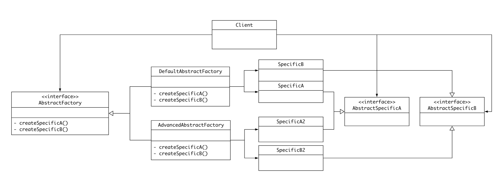

**优点：**
- 将客户与类的实现分离，产品的类名在具体的工厂中被实例化。
- 更易于交换产品系列 （比如不同风格的组件、皮肤等）
- 利于产品一致性：一个应用一次只能使用一个系列中的对象

**缺点**
- 难以支持新种类的产品：  增加新的产品需要扩展工厂接口，涉及抽象工厂接口和所有子类的改变；解决方案：在创建产品的方法中指定参数，要创建什么类型的产品，但是客户端不能区分或对一个产品类别进行安全的假定。

**实现**
- 具体的工厂单例实现（推荐）
- 每个产品系列都要有一个新的具体工厂（强制）
- 如果有多个可能的产品系列，可以使用原型模式来实现具体工厂
- 定义可扩展的工厂，解决上述的缺点问题。

#### 标准工厂

- 定义工厂抽象方法，每个具体的工厂可以制造不同的产品 ， 延迟实例化 ， 由子类决定要实例化的产品是什么类（强调创建者不需要知道具体的类，而交给实际的产品工厂）
- 创建者通常会包含依赖抽象产品的方法。创建者不需要知道产品的具体实例
- 通过这个依赖抽象产品的方法，我们可以变更、操作 产品

**意图：**
定义一个用于创建对象的接口，由子类决定实例化哪一个类。

**适用性：**
当一个类不知道它所必须创建的对象的类的时候

**协作：**
依赖工厂子类来创建一个适当的产品
 
**举例：**
沃尔玛需要售卖鞋子，持有不同品牌的工厂，就能得到不同品牌的鞋子。

**结构：**
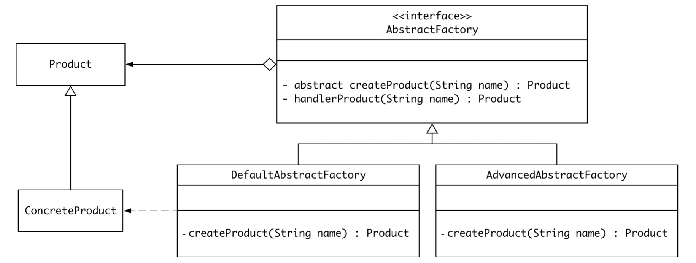

**优点：**
- 延迟类的实例化。
- 隔离用户创建对象的细节。
 
**缺点：**
- 为创建合适的子类，强迫创建工厂子类，可使用模板工厂避免

**实现：**
参数化工厂方法，耐克工厂不仅仅生产经典款的鞋子，还可以生产其他型号鞋子，只要在入参中指定。

**对比：**
抽象工厂模式使用工厂方法实现。

**示例代码：**
标准工厂：

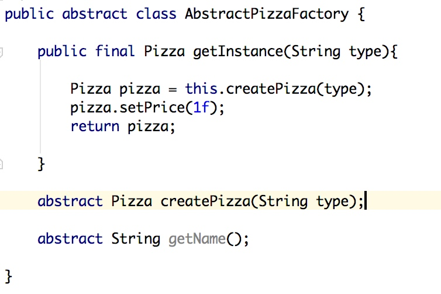

模板工厂：
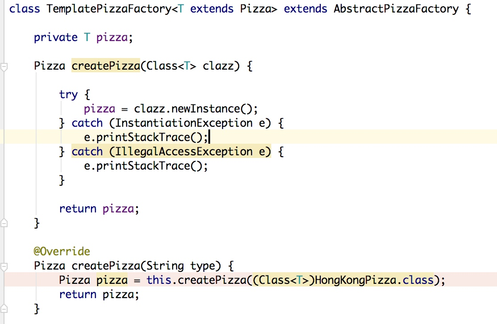

#### 简单工厂

严格来说 这种写法并不是工厂方法 ， 而是一种编程习惯

#### 生成器-Builder

**意图：**
将一个复杂对象的构建过程和他的表示分离；同样的创建过程可以创建不同的表示
 
**适用性：**
- 当构造过程必须允许被构造的对象有不同表示时。
- 当创建复杂对象的算法，应该独立于该对象的组成部分以及他们的装配方式
 
**协作：**
- 创建Director对象，并配置Builder对象
- 产品部件生成，就会通知Builder
- Builder处理Director 请求，添加部件到产品中
- Director 从Builder中获取产品
 
**举例：**
机器人产品的部件： 四肢、背部、大脑；不同的属性可以创建不同的机器人

Director: 工厂
Builder: 组装生产线
ConcreteBuilder: 战争机器人生产线
Product: 机器人

Director__提供__不同的机器人组件，ConcreteBuilder负责组装Product，Director从组装生产线中获取最终的Product。

**结构：**

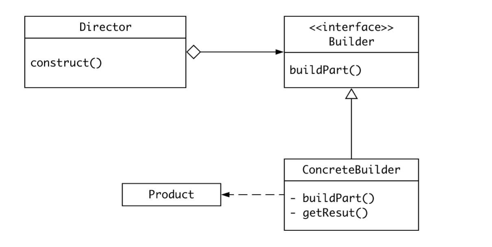

**优点：**
- 生成器隐藏了产品的表示和内部结构，以及装配过程；可以方便的改变一个产品的内部表示:定义一个新的生成器
- 对构造过程可以更精细的控制
 
**缺点：**
- 创建产品的过程冗长；

**实现：**
- 装配和构造接口：因为是逐步的构造产品，所以Builder的接口必须足够普遍，以便为各种类型的具体生成器构造产品
- 产品不设计成抽象类，因为不同的生成器生产的都是特定的产品，特征相差很远，并且生成器和产品一一对应，客户端能够正确处理。
- Builder的方法不定义成抽象方法，定义成空方法，由子类自定义。

**对比：**
Abstract_Factory vs Builder
- Builder着重一步步构造复杂对象 ， AF多个系列的产品对象
- Builder最后一步返回产品，AF立即返回。

#### 原型

**意图：**
用原型示例指定创建对象的种类，并且通过拷贝这些原型创建新的对象

**适用性：**
- 要实例化的类是运行时指定的，比如动态加载；工厂方法要提前定义
- 避免创建和产品统一层级的大量工厂子类
- 当一个类中的实例的组合类型是固定数量的，建立相应的原型并克隆，在注册表中存储，比每次都要手动实例化要方便一些

**协作：**
客户请求一个原型克隆自身
 
**举例：**
《我的世界》游戏中，玩家可以在菜单（注册表）中重复的获取不同的物品（具体原型）

**结构：**
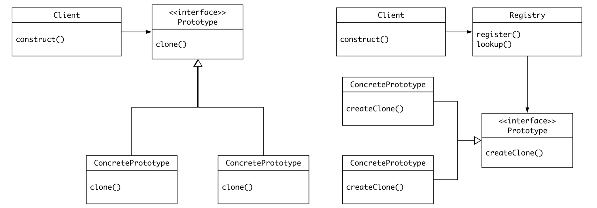

**优点：**
- 可以动态增加或减少产品类。不需要预先定义好工厂类，特别是产品种类很多的时候
- 减少工厂子类的数量
- 工厂方法创建都是同一接口的产品，原型模式可以创建差异很大的产品
- 简化复杂对象的创建过程，通过一个已有实例可以提高新实例的创建效率。
- 可以使用深克隆的方式保存对象的状态。

**缺点：**
- 需要为每一个类配备一个克隆方法，而且这个克隆方法需要对类的功能进行通盘考虑，这对全新的类来说不是很难，但对已有的类进行改造时，不一定是件容易的事，必须修改其源代码，违背了“开闭原则”。
- 在实现深克隆时需要编写较为复杂的代码。

**实现：**
- 使用原型管理器（注册表），客户端会存储和检索原型
- 实现克隆操作（深拷贝），对于复杂对象的克隆是一个挑战

**对比：**
抽象工厂可存储一个原型注册表，并且返回产品对象

#### 单例

**意图：**
确保一个类只有一个实例，并提供一个全局访问点。

**协作：**
- 客户通过Singleton的Instance操作访问一个单件实例
 
**优点：**
- 对唯一实例的受控访问
- 缩小命名空间
- 允许可变数目的实例
 
**实现：**
- Java静态变量可以实现一个类只存在一个实例，但是可能会耗费资源
- 不同的类加载器会重复加载对象，解决方案是指定类加载器
- 私有的构造器，静态方法 & 静态变量
- 变种：Singleton类使用一个单件注册表，主要职责是注册实例和检索实例，缺点是所有的实例都要被创建。

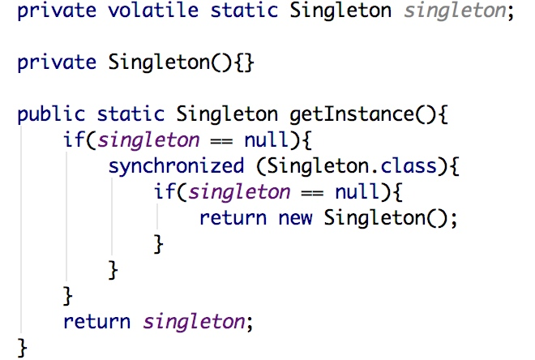

 
    
### 结构型模式

结构型类模式采用集成机制组合接口或实现
结构型对象模式描述了如何对一些对象进行组合，从而实现新功能的一些方法，可以在运行时刻改变对象组合关系
    
#### 适配器

**意图：**
将一个类的接口，转换成客户希望的另外一个接口

**适用性：**
- 想使用一个已经存在的类，而他的接口不符合你的要求
- （适用于Adpater） 想使用一些已经存在的子类，但是不可能对每一个子类进行改造，对象适配器可以适配他的父类接口，即持有抽象父类的引用

**协作：**
- Client调用Adapter的接口方法，Adapter调用 Adaptee的操作实现这个请求 

 
**举例：**
插座只有双孔，为了让三孔电器正常使用，创建适配器，持有三孔电器。

**结构：**
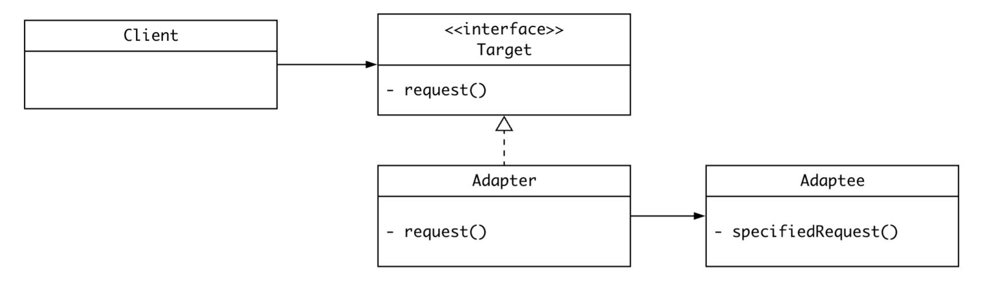
 
**缺点：**
对客户端不透明，无法得知具体的Adaptee对象

**实现：**
- Java不支持多重继承，只支持对象适配器

**对比：**
//TODO

#### 桥接

**意图：**
使抽象部分与他的实现部分分离，使他们都可以独立的变化

**适用性：**
- 不希望抽象和实现有一个固定的绑定关系（只要指实现和抽象在同一个类中）
- 类的抽象和实现都可以通过扩展子类加以扩充，（对不同的抽象接口和实现进行自由组合）

**协作：**
Abstraction将Client请求转发给具体的 Implementor对象
 
**举例：**

1：设想如果要绘制矩形、圆形、椭圆、正方形，我们至少需要4个形状类，但是如果绘制的图形需要具有不同的颜色，如红色、绿色、蓝色等，此时至少有如下两种设计方案：

第一种设计方案是为每一种形状都提供一套各种颜色的版本。
第二种设计方案是根据实际需要对形状和颜色进行组合

对于有两个变化维度（即两个变化的原因）的系统，采用方案二来进行设计系统中类的个数更少，且系统扩展更为方便。设计方案二即是桥接模式的应用。桥接模式将继承关系转换为关联关系，从而降低了类与类之间的耦合，减少了代码编写量。

2： 对于提现系统，不同的渠道内还有不同的币种处理，方案有三

- 定义渠道抽象类，币种抽象类继承渠道抽象类
- 定义渠道抽象类，抽象类持有币种接口的引用，将具体的币种处理操作交给币种接口子类实现。抽象类只负责定义工作，接口类负责实现，这样就将抽象部分和实现部分做了分离。

**结构：**

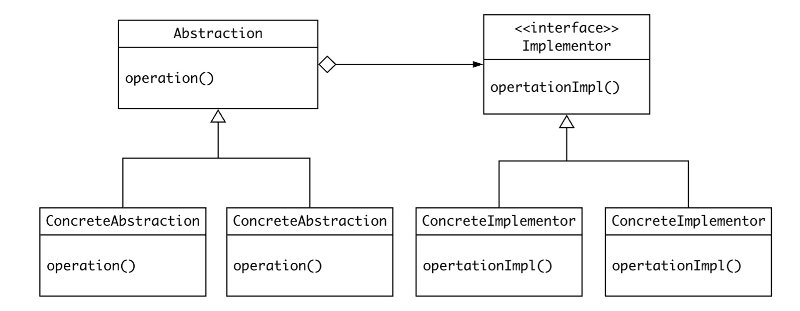

**优点：**
- 分离抽象类及其实现部分：即把本质上并不内聚的两种体系区别开来
- 提高可扩充性，两个平行类结构独立的扩充
 
**缺点：**
过于复杂

**实现：**

- 创建正确的Implementor对象，何时何处创建哪一个 Implementor对象？ 将Implementor传递给构造器
- 可以使用工厂方法创建 Implementor

**对比：**

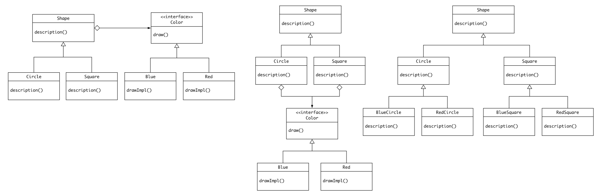

依次是桥接、策略、继承机制，三种常见的方案

- 继承机制将抽象部分和实现部分固定在一起，难以对抽象部分和实现部分独立的修改、扩充

桥接 VS  策略

可以说两者在表象上都是调用者与被调用者之间的解耦，以及抽象接口与实现的分离。桥接模式的有点基本上也是策略模式的优点。

1. 首先，在形式上，两者还是有一定区别的，对比两幅结构图，我们可以发现，在桥接模式中不仅Implementor具有变化（ConcreateImplementior），而且Abstraction也可以发生变化（RefinedAbstraction），而且两者的变化是完全独立的，RefinedAbstraction与ConcreateImplementior之间松散耦合，它们仅仅通过Abstraction与Implementor之间的关系联系起来。而在策略模式中，并不考虑Context的变化，只有算法的可替代性。

2. 其次在语意上，桥接模式强调Implementor接口仅提供基本操作，而Abstraction则基于这些基本操作定义更高层次的操作。而策略模式强调Strategy抽象接口的提供的是一种算法，一般是无状态、无数据的，而Context则简单调用这些算法完成其操作。

3. 桥接模式中不仅定义Implementor的接口而且定义Abstraction的接口，Abstraction的接口不仅仅是为了与Implementor通信而存在的，这也反映了结构型模式的特点：通过继承、聚合的方式组合类和对象以形成更大的结构。在策略模式中，Startegy和Context的接口都是两者之间的协作接口，并不涉及到其它的功能接口，所以它是行为模式的一种。**行为模式的主要特点就是处理的是对象之间的通信方式，往往是通过引入中介者对象将通信双方解耦**，在这里实际上就是将Context与实际的算法提供者解耦。

所以相对策略模式，桥接模式要表达的内容要更多，结构也更加复杂。桥接模式表达的主要意义其实是接口隔离的原则，即把本质上并不内聚的两种体系区别开来，使得它们可以松散的组合，而策略在解耦上还仅仅是某一个算法的层次，没有到体系这一层次。从结构图中可以看到，策略的结构是包容在桥接结构中的，桥接中必然存在着策略模式，Abstraction与Implementor之间就可以认为是策略模式，但是桥接模式一般Implementor将提供一系列的成体系的操作，而且Implementor是具有状态和数据的静态结构。而且桥接模式Abstraction也可以独立变化。

#### 组合

**意图：**
- 将对象组合成树形结构以表示 “部分-整体”的层次结构
- 用户对单个对象和组合对象的使用具有一致性

**适用性：**
- 想表示对象的 部分-整体 层次结构
- 忽略对象和组合的不同，对他们进行统一的操作

**协作：**
- 用户使用 Component接口和组合结构中的对象进行交互，
- 如果接受者是叶节点，直接处理请求
- 如果接收者是组件，通常将请求转发给叶节点，然后在叶节点操作前后执行一些辅助操作
 
**举例：**
树形结构的菜单栏

**结构：**
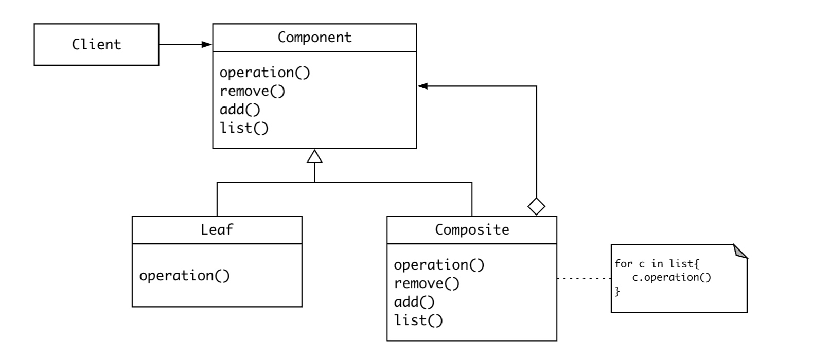

**优点：**
- 简化客户代码，客户一致的使用组合或单个对象，用户不知道它处理的是叶节点还是组件。
- 定义了包含组合对象和基本对象的类层次
- 更容易的增加新类型的组件
 
**缺点：**
- 容易增加组件也会产生一些问题，很难限制组合中的组件，必须在运行时刻检查

**实现：**
- 显示的父部件的引用，通常在接口类中定义父部件的引用，组件和叶节点通过继承以管理这个引用的那些操作。
- 对于父部件的引用，必须维护一个不变式，保证这一点最容易的方法是在增加或删除操作时，才改变父部件的引用。
- 接口要声明一个方法用于访问和管理Component的子组件
- 最大化Component接口，尽可能多定义一些公共操作，通常为这些操作提供缺省的操作，然后在子类中去重实现。
- 在接口类中用集合来存储子类，会造成叶节点的空间浪费

**对比：**
- 组合模式 经常和 装饰者模式一起使用，他们通常有一个公共的父类
- 迭代器模式可以用来便利组件
- FlyWeight模式让你共享组件，但不能再引用他们的父部件
- 访问者模式将本来应该分布在Composite和Leaf类中的操作和行为局部化

## 装饰者

**意图：**
动态将新的责任添加到对象上，除了继承的另一种扩展功能方式，更加的灵活

**适用性：**
- 在不影响其他对象的情况下，动态、透明的方式给单个对象添加职责
- 当不能采用生成子类的方法进行扩充时，1：类爆炸 2：类定义被隐藏

**协作：**
 Decorator将请求转发给Component对象，并在前后添加责任。
 
**举例：**
FileInputStream

**结构：**
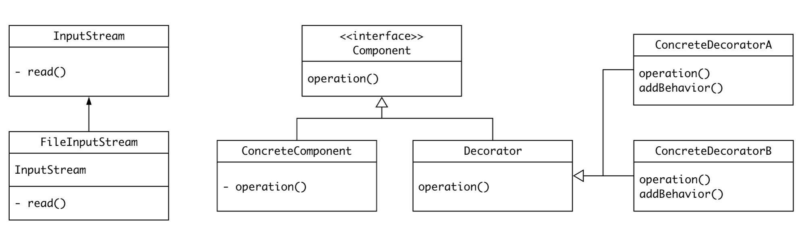

**优点：**
- 动态 透明 灵活
- 不必为不需要的特征付出代码，可以逐步的添加需要的功能

**缺点：**
- 有许多小对象，很难学习这个系统，排错困难。

**实现：**
- 接口一致性，必须与被装饰的Component接口一致。
- 抽象的Decorator类，在你仅需要添加一个职责的时候，可以省略
- 保持Component类的简单性，侧重于定义接口而不是存储数据

**对比：**
策略模式
- 改变对象外壳VS改变对象内核
- 装饰者模式必须要有统一的接口，策略模式可以有特定的接口

适配器
- 前者只增加职责，不改变接口，后者为对象新增一个全新的接口‘

组合模式
- 退化的、仅有一个组件的的组合，目的不在于结构聚集 

## 门面（外观）

**意图：**
为子系统的一组接口提供一个一致的界面，Facade模式定义了一个高层接口，使得子系统更加容易的使用

**适用性：**
- 要为一个复杂子系统提供一个简单接口时
- 客户程序与抽象类的实现部分之间存在很大的依赖性，门面将这个子系统与客户进行分离
- 如果子系统之间是相互依赖的，可以统一让不同的子系统通过Facade进行通讯，避免相互依赖

**协作：**
- 客户程序通过发送请求给Facade的方式与子系统通讯，Facade将这些消息转发给适当的子系统
- Facade还是要将子系统的接口原样的定义
- 使用Facade的客户程序不需要直接访问子系统对象

**举例：**
业务系统对账务系统的操作，可以引用结算接口（门面）进行分离，和统一的账务接口管理组合。

**结构：**

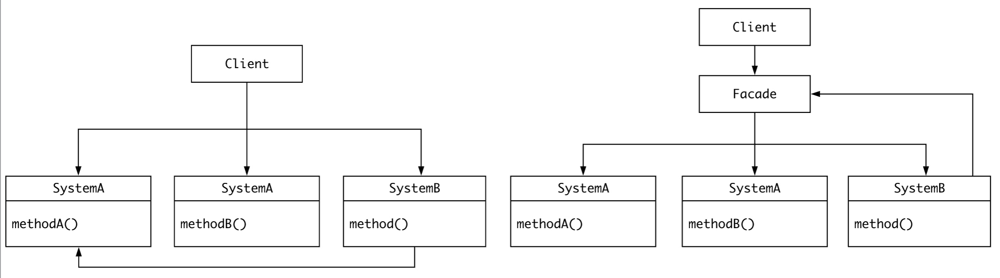

**优点：**
- 屏蔽子系统组件，减少要处理的对象数目 
- 子系统和客户之间解耦

**缺点：**

**实现：**
- 进一步降低客户-子系统的耦合度：抽象类实现Facade,而他的具体子类对应不同的子系统实现。

**对比：**
与工厂方法合作，可以代替Facade模式隐藏具体的子系统对象。
Mediator模式有相似之处 //TODO
Facade模式通常也是单例模式

#### 享元

**意图：**

**适用性：**

**协作：**
 
**举例：**

**结构：**

**优点：**
 
**缺点：**

**实现：**

**对比：**

#### 策略模式

**描述：**

定义算法族，相互之间可以替换，使得客户端可以动态使用不同的算法

针对接口编程，而不是针对实现编程

抽象出可变的行为，利用接口代表行为。而不是针对Duck类的具体实现。特定的实现写在行为的实现类中。

针对接口编程： 针对超类型编程，超类型可以理解为 抽象类和接口类；利用多态，执行时根据实际情况执行到真正的行为；将行为的具体实现委托给超类型。

#### 观察者模式

以松耦合方式在一系列对象之间沟通状态，代表：MVC

 

## 代理

## 模板
## 命令
## 观察者

## 状态
## 迭代器
## 访问者
## 责任链
## 解释器
## 备忘录
## 中介者

